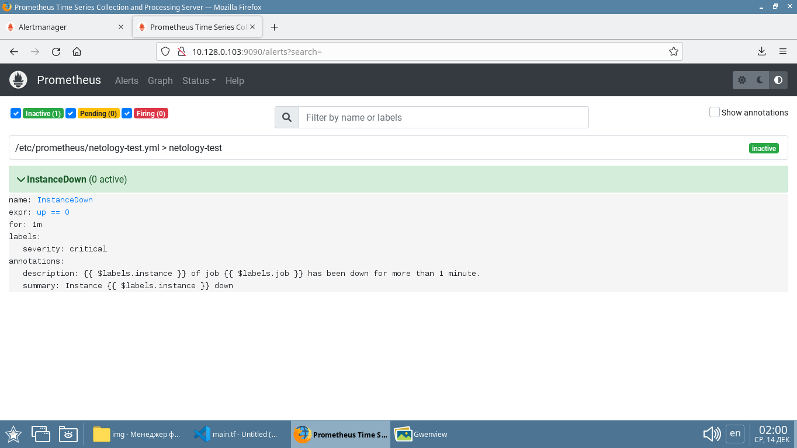
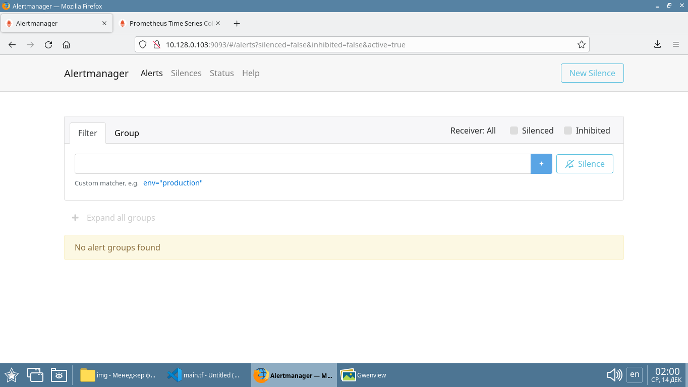
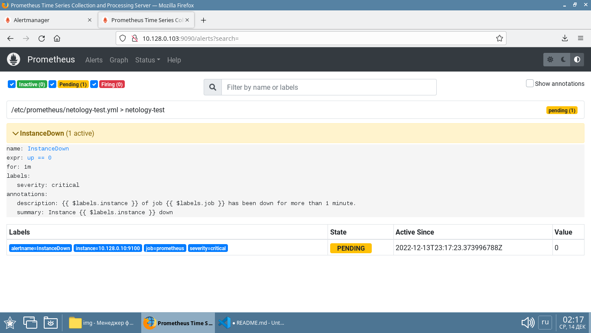
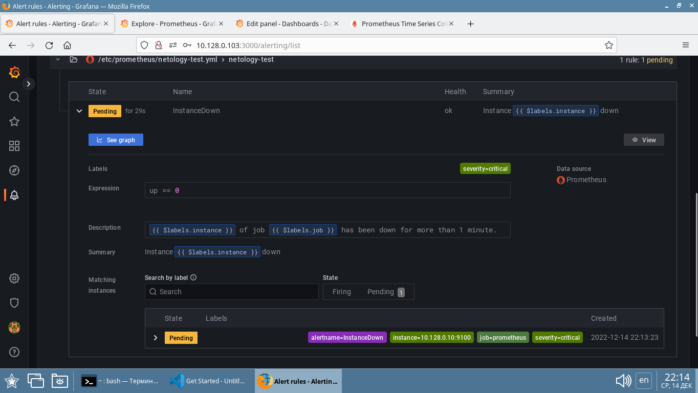
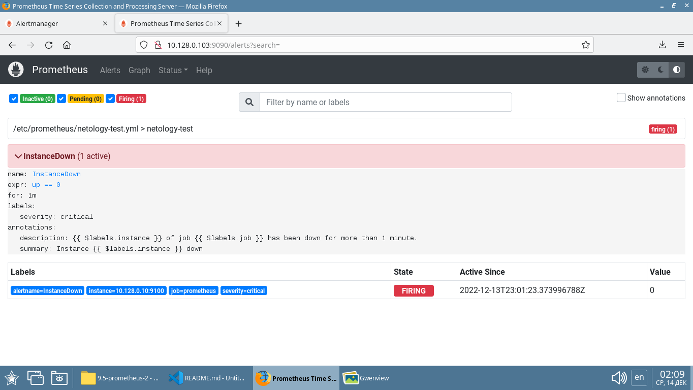
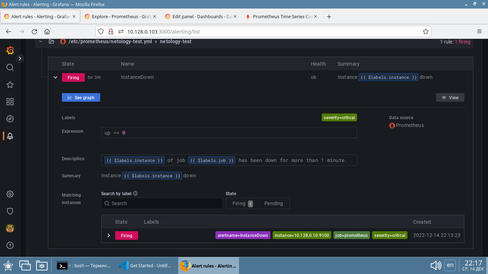
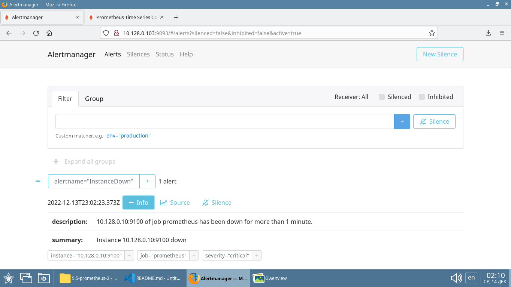
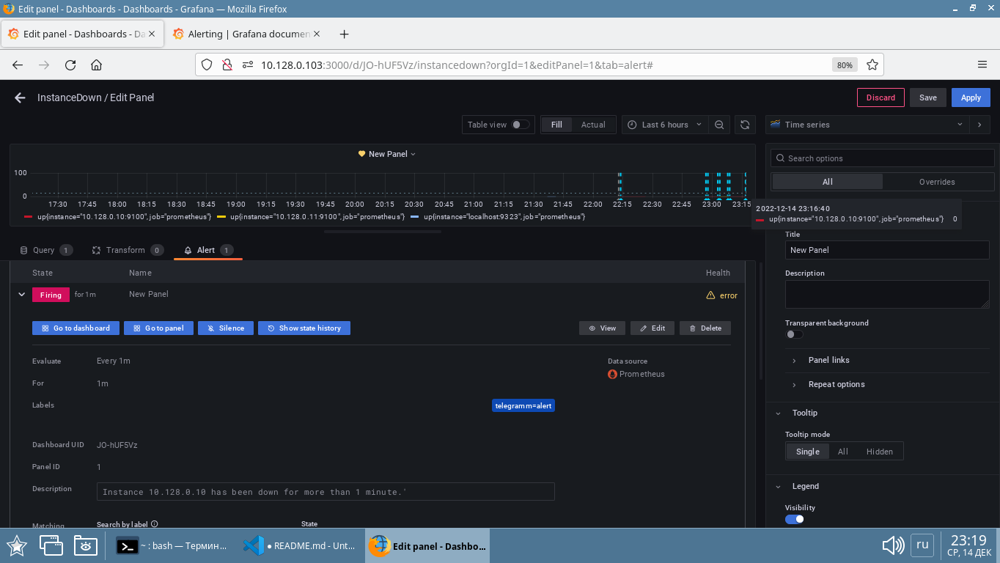
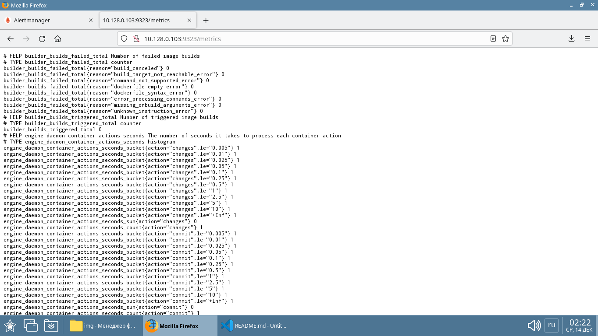

# Домашнее задание к занятию "9.5. Prometheus ч.2 - `Елена Махота`"
**

- [Ответ к Заданию 1](#1)
- [Ответ к Заданию 2](#2)
- [Ответ к Заданию 3](#3)
- [Ответ к Заданию 4*](#4)

### Задание 1. 

Создайте файл с правилом оповещения, как в лекции, и добавьте его в конфиг Prometheus.

*Погасите node exporter, стоящий на мониторинге, и прикрепите скриншот раздела оповещений Prometheus, где оповещение будет в статусе Pending.*

### *<a name="1">Ответ к Заданию 1</a>*

Погасила один из хостов, в разделе оповещений Prometheus появилось оповещение  в статусе Pending 

 

В Grafana этот  оповещение  в статусе Pending также отображается:

---

### Задание 2. 

Установите Alertmanager и интегрируйте его с Prometheus.

*Прикрепите скриншот Alerts из Prometheus, где правило оповещение будет в статусе Fireing, и скриншот из Alertmanager, где будет видно действующее правило оповещения.*

### *<a name="2">Ответ к Заданию 2</a>*

Правила оповещения можно настраивать непосредственно в Grafana без использования Alertmanager, в том числе с отправкой сообщений в telegramm, почту и др.

https://grafana.com/docs/grafana/latest/alerting/

---

### Задание 3. 

Активируйте экспортер метрик в Docker и подключите его к Prometheus.

*Приложите скриншот браузера с открытым эндпоинтом, а также скриншот списка таргетов из интерфейса Prometheus.*

### *<a name="3">Ответ к Заданию 3</a>*

---
## Дополнительные задания (со звездочкой*)

Эти задания дополнительные (не обязательные к выполнению) и никак не повлияют на получение вами зачета по этому домашнему заданию. Вы можете их выполнить, если хотите глубже и/или шире разобраться в материале.

---

### Задание 4*. 

Создайте свой дашборд Grafana с различными метриками Docker и сервера, на котором он стоит.

*Приложите скриншот на котором будет дашборд Grafana с действующей метрикой.*

### *<a name="4">Ответ к заданию 4*</a>*

